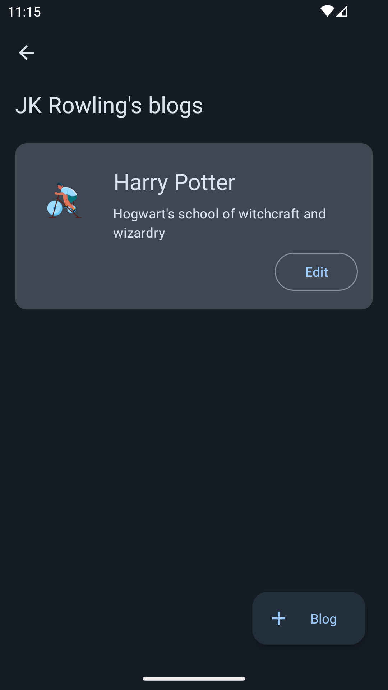

# :green_book: Blog App
Simple blog android app intended to demonstrate Material Design principles

## What I learned
* Clean MVVM architecture
* Material 3 UI design
* Dynamic colours

## Screenshots

## Usage
Feel free to use as an example for your projects
